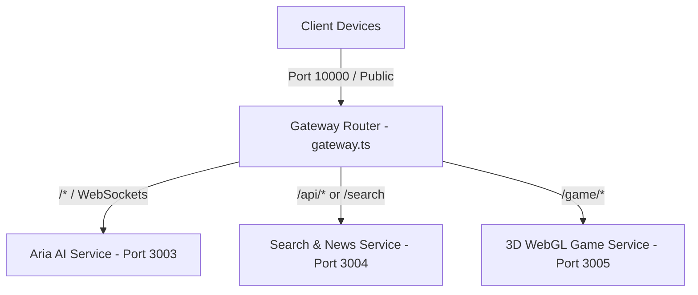

# Nexal Unified Backend Gateway

A high-performance unified backend orchestrator and gateway that bundles and runs the three core sub-services of the **Nexal** ecosystem (**Aria AI**, **World Search & RSS News**, and the **3D WebGL Game**) behind a single proxy gateway. 

This repository is designed for automated deployments (such as **Render** or **Heroku**) to host all three backend instances on a single public port, minimizing hosting slots and routing overhead.

---

## 🏗️ Architecture & Port Mappings

The backend operates as a gateway proxy router that spawns three independent sub-services on separate internal loopback ports, proxying incoming requests dynamically:



### Routing Table:
* **`/game/*`** → Proxied internally to **Game Backend** (`http://localhost:3005`)
* **`/api/*` or `/search`** → Proxied internally to **Search Backend** (`http://localhost:3004`)
* **`/*` (and WebSocket upgrades)** → Proxied internally to **Aria AI Backend** (`http://localhost:3003`)

---

## 📂 Project Structure

* **`src/gateway.ts`**: The main gateway server written in TypeScript. Spawns the sub-backends, runs health-checks to verify they are alive, and proxies traffic using `http-proxy`.
* **`aria_backend/`**: AI assistant micro-service featuring LLM completions and Socket.IO real-time voice/chat streams.
* **`search_backend/`**: Web search helper, Google News RSS scraper, and Open Graph image parser.
* **`game_backend/`**: Express static server hosting the space delivery 3D WebGL game assets.

---

## ⚡ Setup & Development

### 1. Installation
Install dependencies for the gateway and all three sub-backends automatically using:
```bash
npm install
```
*(The `postinstall` hook will automatically execute `npm install` inside the sub-directories).*

### 2. Run in Development Mode
Launch the gateway and all three micro-services concurrently in watch/development mode:
```bash
npm run dev
```

### 3. Run Micro-services Individually
If you want to run only one sub-service for debugging:
* **Aria AI**: `npm run aria`
* **Search**: `npm run search`
* **Game**: `npm run game`

---

## 🚀 Production Build & Deployment

### 1. Local Compilation & Production Start
Compile all TypeScript files and boot up the production servers:
```bash
npm run build
npm start
```

### 2. Render Deployment Configuration
This repository is configured for automated **Continuous Delivery (CD)** on **Render**:
* **Runtime**: `Node`
* **Build Command**: `npm run build`
* **Start Command**: `npm start`
* **Environment Variable**: Set `PORT` (defaults to `10000`). The gateway binds to `0.0.0.0` on this port.
